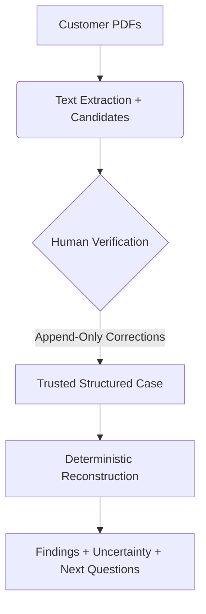
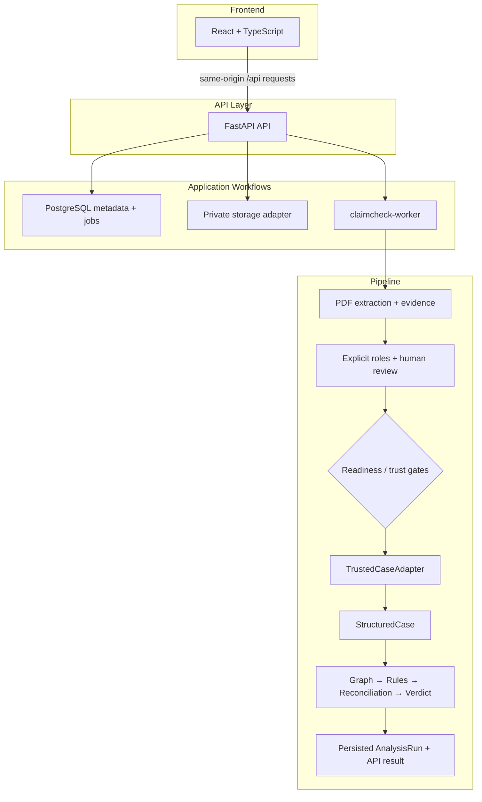

# 🔎 CLAIMCHECK

**An evidence-first health-insurance settlement review service.**

*CLAIMCHECK organizes policy wording, a policy schedule, a hospital bill, and a settlement/rejection letter into a reviewed, provenance-aware reconstruction—so people can see what is supported, what is uncertain, and what to ask next.*

---

## 1. The Problem: The Quiet Majority of Lost Money

When an Indian policyholder is discharged from the hospital, they receive a settlement or rejection letter. The amount paid is frequently below expectation, but the letter rarely explains the exact arithmetic or policy clause used to justify deductions.

> **₹15,100 Crore Disallowed (12.9%)**  
> In FY 2023-24, out of ₹1.17 lakh crore registered health claims, the largest bucket of lost money wasn't outright rejection—it was claims that were approved but silently cut down.

While free escalation machinery exists (Grievance Officers, Bima Bharosa, the Insurance Ombudsman), it is built for people who already know exactly what to allege and can prove it with figures and clauses. Most policyholders lack the diagnosis needed to challenge a deduction.

---

## 2. The Core Idea: Reconstructing the Claim

A large part of an Indian health-insurance deduction is not a black box. It is a stack of named, individually rule-governed arithmetic steps applied to an itemised bill (e.g., non-payable items removal, room-rent sub-limits, proportionate deductions, and co-pays). Each step has a source that can be pointed at.

### **EXTRACTION ≠ TRUTH**

A parser or Language Model may propose a monetary amount, a policy limit, a deduction, or a boolean condition. But a candidate does not become authoritative simply because a parser found it. CLAIMCHECK explicitly separates candidate extraction from deterministic analysis.

---

## 3. Product Workflow & Trust Gating

1. **Upload**: Users upload the Policy Wording, Policy Schedule, Hospital Bill, and Settlement Letter.
2. **Background Processing**: PDF extraction runs asynchronously in a durable worker queue. Extracted values are strictly linked to the original document, the page, the exact source text/span, and the extraction method.
3. **Evidence-First Human Review**: The user enters the Evidence UI: **Candidate → Evidence → Human decision**. The user must explicitly act on each extracted candidate (*Confirm, Correct, or Can't Verify*).
4. **Readiness / Trust Gate**: Analysis cannot simply run because candidate fields exist. The `TrustedCaseAdapter` checks whether all required inputs are present, properly typed, explicitly verified by a human, and supported by trusted provenance.
5. **Deterministic Reconstruction**: Once a case is trusted, **deterministic application code** owns the entire calculation pipeline (financial arithmetic, limits, deductions, reconciliation, and verdict semantics).

---

## 4. Why Deterministic Calculation?

LLMs and parsers can assist with locating and proposing information, but financial settlement arithmetic must be reproducible, inspectable, deterministic, testable, and auditable.

* **Models/parsers**: READ / LOCATE / NORMALIZE / PROPOSE
* **Deterministic application logic**: DECIDE / CALCULATE / RECONCILE / ASSIGN VERDICT

This architectural boundary prevents a language model from inventing financial values, ignoring a deductible, or silently changing arithmetic to reach a pleasing answer.

### Exact Monetary Arithmetic (Integer Paise)
CLAIMCHECK represents all monetary values internally as integer paise.
- **₹5,00,000** → `50,000,000 paise`
- **1% room-rent limit (₹5,000)** → `500,000 paise`
- **Settlement amount (₹86,638.50)** → `8,663,850 paise`

This guarantees exact monetary representation inside the application, prevents binary floating-point ambiguity, allows exact reconciliation, and accurately preserves edge cases like `.50` paise. 

---

## 5. Result States

CLAIMCHECK yields one of three core interpretation states for any deduction:

| State | Meaning |
|:---|:---|
| **SUPPORTED** | Evidence and deterministic rules mathematically support the deduction. *(Note: This does not mean "legally proven correct"; it means the math aligns structurally with the text).* |
| **POTENTIALLY INCONSISTENT** | The available evidence and deterministic calculation indicate a discrepancy or structural inconsistency that deserves attention. *(Note: This does not automatically mean illegal or fraudulent).* |
| **UNDETERMINED** | The available documents/evidence are insufficient to reach a deterministic conclusion (e.g. unpublished "Reasonable and Customary" rates). |

---

## 6. System Architecture

---

## 7. Evidence & Provenance Model

Provenance is the backbone of CLAIMCHECK.

> `Document` → `Processing run` → `Page` → `Evidence span` → `Candidate field` → `Review decision` → `Trusted field` → `Analysis run` → `Calculation step`

This strict chain prevents unsupported values from entering the deterministic calculator. Every `Trusted field` must be explicitly scoped to a verified `Evidence span`. The original PDF is retained as the immutable source artifact, ensuring the review always remains linked to the original evidence.

---

## 8. Deployment (AWS Target)

**AWS Competition Deployment Target:**
- **Region**: `ap-south-1` (Mumbai)
- **Host**: Single EC2 Instance (`t3.small`)
- **OS**: Amazon Linux 2023
- **Services**: Nginx, FastAPI, Python Worker, PostgreSQL (Native)
- **Frontend**: Vite production build served through Nginx
- **Storage**: `/var/lib/claimcheck/private-storage`

**Request Path:**
`Browser` → `Nginx` (Serves React assets / Reverse Proxies API) → `FastAPI` ↔ `PostgreSQL` / `Private Storage` / `Worker`

---

## 9. Local Development

1. **Environment**: Copy `.env.example` to `.env`.
2. **Database**: Run PostgreSQL locally.
3. **Migrations**: `alembic upgrade head`
4. **API**: `python -m uvicorn claimcheck.api.app:app --port 8000 --reload`
5. **Worker**: `claimcheck-worker`
6. **Frontend**: `cd web && npm install && npm run dev`

---

## 10. Testing & Validation

The repository contains **423 tests** encompassing deterministic rules, integer paise preservation, provenance tracking, trust-gate enforcement, and API vertical slices.

### End-to-End Validation
The system successfully completed a full 4-PDF E2E scenario targeting Indian health policies:
- **Sum insured**: ₹5,00,000
- **Room rent rule**: 1% of sum insured
- **Normalized room rent limit**: ₹5,000/day
- **Settlement final payable**: ₹86,638.50

In this validation, 4 PDFs were ingested, extracted, manually reviewed, seamlessly reconstructed deterministically, and accurately reconciled to exactly `.50` paise without truncation.

---

## 11. Limitations & Non-Goals

- CLAIMCHECK is **not** legal advice and does not declare insurer liability.
- It does **not** replace insurer adjudication or guarantee recovery of money.
- It does **not** treat Language Model extraction as authoritative financial truth.
- It requires explicit human verification before running analysis.
- The repository supports isolated research ML experiments on synthetic data, but these are **not** connected to the production worker's final financial verdicts.

<i>Built for the questions that matter when a claim doesn't add up.</i>

