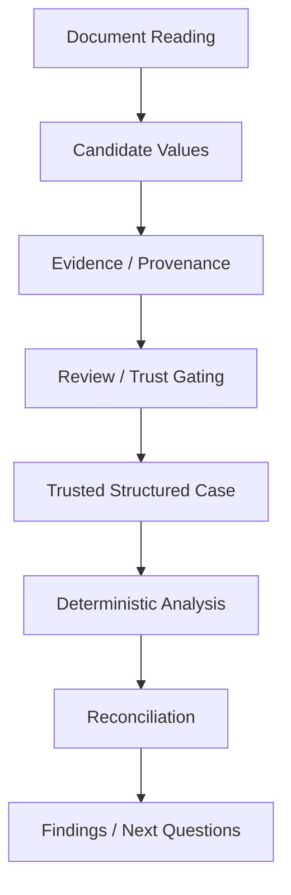
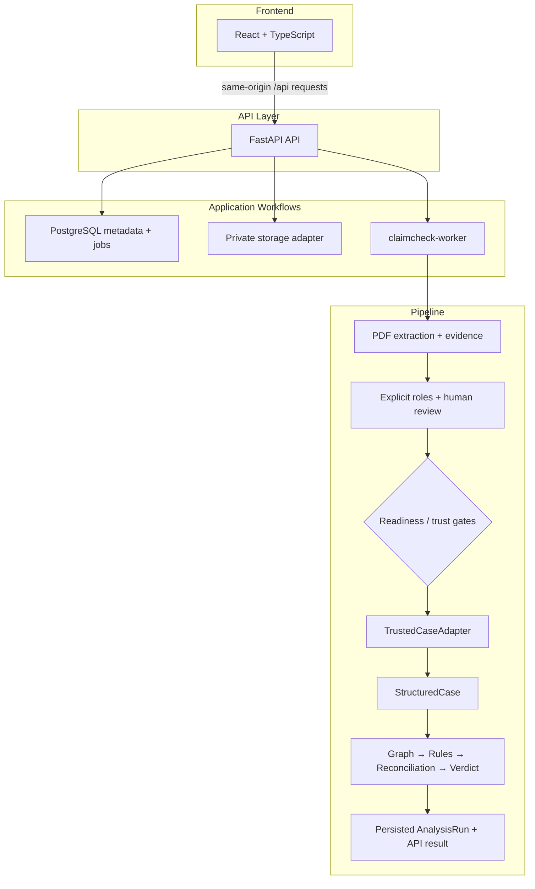
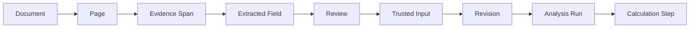

# CLAIMCHECK

**Live Application:** [http://65.2.161.137](http://65.2.161.137)

An evidence-first health-insurance settlement review service.

CLAIMCHECK organizes a policy wording, policy schedule, hospital bill, and settlement letter into a reviewed, provenance-aware reconstruction. It prevents unverified extraction output from directly controlling deterministic financial analysis.

---

## 1. What CLAIMCHECK Solves

When an Indian policyholder is discharged from a hospital, the final amount paid by the insurer often differs from the hospital bill. The settlement letter typically lists deductions but rarely explains the exact arithmetic or the specific policy clauses invoked to justify them.

To audit a payout, a user must connect a deduction to:
- a specific bill line
- a specific policy clause
- a limit in the schedule
- an insurer-paid amount

While free escalation machinery exists, it is built for policyholders who already know exactly what to allege and can prove it with figures and clauses. Most policyholders lack the specific diagnosis needed to challenge a deduction.

CLAIMCHECK reconstructs the settlement mathematically. It is **not** a document summarizer, a chatbot, an autonomous agent, or a legal complaint generator. It is a structured, evidence-backed settlement reconstruction and review system.

---

## 2. Core Design Principle: Extraction is Not Truth

The fundamental architectural principle of CLAIMCHECK is that **extraction is not truth.** 

A parser or Language Model may *propose* a monetary amount, a policy limit, a deduction, or a boolean condition. However, a candidate value does not become authoritative simply because a parser found it. 

CLAIMCHECK strictly separates extraction from analysis:



**Models/Parsers**: READ / LOCATE / NORMALIZE / PROPOSE
**Deterministic Application Logic**: DECIDE / CALCULATE / RECONCILE / ASSIGN VERDICT

This separation ensures that a language model cannot invent financial values, ignore a deductible, or silently change arithmetic to reach a pleasing answer.

---

## 3. End-to-End Workflow

1. **Case creation**: A Case is created to securely scope a single hospital admission.
2. **PDF upload and validation**: Users upload the Policy Wording, Policy Schedule, Hospital Bill, and Settlement Letter.
3. **Private persistence**: Documents are uniquely hashed (SHA-256) and saved safely.
4. **Durable document-processing job**: Dispatched asynchronously to prevent blocking the API.
5. **PDF extraction**: The worker parses pages and extracts candidate fields.
6. **Document-role handling**: Validates that uploaded documents match expected required roles.
7. **Evidence span creation**: Candidates are explicitly linked to spatial coordinates in the source PDF.
8. **Candidate field creation**: Values are staged but untrusted.
9. **Automatic verification**: Deterministic evidence is accepted automatically if fully unambiguous.
10. **Exception-based human review**: Human intervention is required when evidence is ambiguous, parsing fails, or critical values lack trusted provenance.
11. **Append-only corrections**: Human review decisions are appended, preserving raw extraction history.
12. **Input revision**: A snapshot of trusted inputs is created for analysis.
13. **Readiness evaluation**: The system checks if all required inputs are present.
14. **TrustedCaseAdapter**: Converts persisted, reviewed state into a domain-level `StructuredCase`.
15. **Analysis run**: The deterministic calculator executes.
16. **Deterministic calculation graph**: Executes the financial logic.
17. **Reconciliation**: Compares reconstructed calculations with the insurer's stated payment.
18. **Persisted AnalysisRun**: The results are durably saved.
19. **Results API**: Frontend fetches the output.
20. **Evidence-first frontend presentation**: Results are shown strictly linked to their PDF evidence.

---

## 4. Architecture

CLAIMCHECK is built as a modular monolith designed for rigorous domain boundaries.



---

## 5. Document Processing

PDF processing is handled strictly to guarantee artifact integrity:
- **PDF Validation**: Checks file extensions, structure signatures, and size limits.
- **Identity**: SHA-256 hashing ensures documents are deduplicated and tracked.
- **Private Persistence**: Files are written to an internal storage path, never exposed to the public web root.

Processing jobs are managed via durable state transitions:
`UPLOADED` → `PROCESSING` → `READY` / `NEEDS_REVIEW` / `EVIDENCE_GAP` / `FAILED`

---

## 6. Evidence & Provenance

The provenance chain ensures that the system can always answer: *"Where did this number come from?"*



A monetary value cannot reach the deterministic calculator merely because a parser produced it. It must trace back through a verified Evidence Span directly to the source PDF. 

---

## 7. Review & Trust Gating

Candidate extraction is distinct from a **trusted input**.

The **TrustedCaseAdapter** acts as the boundary that converts persisted, reviewed application state into the domain-level `StructuredCase` expected by the deterministic analysis engine. The calculator never consumes arbitrary database rows or raw extraction output.

The gate checks:
- Are all required fields present?
- Are they properly typed?
- Do they have the required provenance?
- Have ambiguous fields been explicitly reviewed by a human?

---

## 8. Input Revisions + Analysis Pinning

An analysis is tied to a specific trusted input revision. 

If a user changes or corrects a value after an analysis:
- The input revision changes.
- The previous analysis is **not** silently reused as if it represented the new input.
- The next analysis works against the new revision.

This ensures strict reproducibility and auditability.

---

## 9. Deterministic Analysis Engine

The core calculator transforms the `StructuredCase` into an explicit calculation graph:

**Graph → Rules → Calculation → Reconciliation → Verdict**

The engine evaluates:
- Hospital bill line items
- Non-payable deductions
- Policy-specific limits (e.g., Room Rent constraints)
- Eligible/admissible amounts
- Co-pays
- Reconstructed payable amounts

*Note: The engine only executes implemented rules. It does not hallucinate general insurance concepts if they are not strictly codified in the rule engine.*

---

## 10. Money Model — Integer Paise

All financial arithmetic uses **integer paise**.

Example:
- ₹5,00,000 = `50,000,000 paise`
- 1% of ₹5,00,000 (₹5,000) = `500,000 paise`
- ₹86,638.50 = `8,663,850 paise`

This design:
- Avoids binary floating-point ambiguity.
- Allows exact equality and reconciliation.
- Preserves exact `.50` values.
- Makes financial calculations strictly deterministic.

---

## 11. Reconciliation & Verdict Semantics

Reconciliation compares the deterministic reconstructed payable amount against the documented amount paid by the insurer. A difference is not automatically evidence of insurer wrongdoing.

| State | Meaning |
|:---|:---|
| **SUPPORTED** | Evidence and deterministic rules mathematically support the deduction. *(Note: This does not mean "legally proven correct"; it means the math aligns structurally with the uploaded text).* |
| **POTENTIALLY INCONSISTENT** | The available evidence and deterministic calculation indicate a discrepancy or structural inconsistency. *(Note: This does not automatically mean illegal or fraudulent).* |
| **UNDETERMINED** | The available documents/evidence are insufficient to reach a deterministic conclusion (e.g., unpublished "Reasonable and Customary" rates). |

---

## 12. Data & Persistence Model

PostgreSQL maintains durable product state, provenance metadata, review states, and job execution logs. 

Key Entities:
- **Case**: The security boundary for a user's claim event.
- **Document**: The raw PDF metadata and hash identity.
- **ProcessingJob / Run**: Async work trackers.
- **EvidenceSpan**: The coordinates and raw text of parser candidates.
- **ReviewCorrection**: Append-only log of human decisions.
- **InputRevision**: Snapshot of trusted inputs for a specific execution.
- **AnalysisRun**: The deterministic execution log.

Original PDFs are stored safely in private local storage, entirely separate from the web root.

---

## 13. Frontend / Evidence UI

The React frontend is an **Evidence UI**, not a dashboard or a chatbot.

**Flow:** `Landing` → `Upload` → `Processing` → `Review` → `Results` → `Evidence` → `Next steps`

It allows users to inspect sources, confirm/correct candidates, and view results strictly linked back to their source pages. The frontend performs no client-side financial calculations.

---

## 14. Background Jobs

PDF extraction is computationally heavy and unpredictable. To prevent blocking synchronous API requests, work is dispatched to `claimcheck-worker`. The worker claims durable PostgreSQL jobs, manages leasing and retries, and executes page parsing and extraction asynchronously.

---

## 15. Security & Privacy

- **Owner-Scoped Access**: Cases and documents belong strictly to the owner.
- **Private Storage**: Uploaded PDFs are never exposed to the public internet.
- **Internal APIs**: The FastAPI backend and PostgreSQL database are completely internal, accessible only behind the Nginx reverse proxy.
- **Safe APIs**: Tracebacks and document contents are never leaked in API error responses.

*(Note: CLAIMCHECK does not claim HIPAA, SOC2, or ISO certification).*

---

## 16. Validation & Testing

The repository contains 423 tests covering:
- PDF validation and document lifecycle.
- Provenance and owner isolation.
- Trust gating and input revisions.
- Deterministic calculator and integer paise preservation.
- API vertical slices.

### Validated E2E Example
The system successfully processed a complete 4-PDF flow with the following parameters:
- **Hospital bill**: ₹97,015.00
- **Policy**: ₹5,00,000 sum insured
- **Room rent**: 1% of sum insured (→ ₹5,000/day)
- **Settlement**: ₹86,638.50

CLAIMCHECK read the documents, extracted candidates tied to evidence, resolved required reviews, created a trusted structured case, ran deterministic calculation, and reconciled the documented payment exactly, preserving the `.50` paise perfectly.

---

## 17. Research / ML Experiments

CLAIMCHECK's production financial verdict **does not** depend on an ML model predicting the final amount.

While the repository may contain isolated research ML experiments (e.g., Model A Challenger) evaluated on controlled synthetic data, these are **not** connected to the production worker and do not influence authoritative financial verdicts. They are not evidence of real-world claim-settlement accuracy.

---

## 18. Deployment

**Competition Target Architecture:**
- **Region**: `ap-south-1`
- **Host**: Single EC2 Instance (`t3.small`)
- **OS**: Amazon Linux 2023
- **Services**: Nginx, FastAPI, Python Worker, PostgreSQL (Native)
- **Storage**: `/var/lib/claimcheck/private-storage`

**Request Path:**
`Browser` → `Nginx` (Serves React assets / Reverse Proxies `/api`) → `FastAPI` ↔ `PostgreSQL` / `Private Storage` / `Worker`

---

## 19. Repository Structure

```
claimcheck/
├── src/claimcheck/          
│   ├── api/                 # FastAPI routes, schemas, and dependencies
│   ├── application/         # Core workflows, trust gating, TrustedCaseAdapter
│   ├── calc/                # Deterministic financial arithmetic (integer paise)
│   ├── evidence/            # Provenance and span modeling
│   ├── persistence/         # SQLAlchemy models and local storage
│   ├── rules/               # Indian health policy evaluation logic
│   ├── verdict/             # Finding and state-machine generation
│   └── worker/              # Durable background processing loop
├── web/                     # React/Vite Frontend
├── migrations/              # Alembic schemas
├── scripts/                 # Setup and deployment scripts
└── tests/                   # 423 Pytest test cases
```

---

## 20. Local Development

1. **Environment**: Copy `.env.example` to `.env`.
2. **Database**: Start a local PostgreSQL instance.
3. **Migrations**: `alembic upgrade head`
4. **API**: `python -m uvicorn claimcheck.api.app:app --port 8000 --reload`
5. **Worker**: `claimcheck-worker`
6. **Frontend**: `cd web && npm install && npm run dev`

---

## 21. API / Operational Flow

The API design strictly enforces the product boundaries:
- `POST /api/v1/cases`: Intake boundary.
- `POST /api/v1/cases/{id}/documents`: Document processing boundary.
- `GET /api/v1/cases/{id}/review-queue`: Review/readiness boundary.
- `POST /api/v1/cases/{id}/analyze`: Deterministic analysis boundary.
- `GET /api/v1/cases/{id}/analysis`: Result retrieval boundary.

---

## 22. Limitations & Non-Goals

- CLAIMCHECK is **not** legal advice.
- It does **not** replace insurer adjudication or guarantee claim recovery.
- Ambiguous policy language (e.g., "Reasonable and Customary") can remain `UNDETERMINED`.
- Extracted candidates are not authoritative without trust gating.
- Production financial results are deterministic but only as good as the verified inputs and the implemented rules.

---

## 23. Why This Approach?

CLAIMCHECK is technically interesting because it abandons the "AI summarizes documents" paradigm in favor of rigid engineering controls:

1. **Extraction separated from truth**: Prevents hallucination.
2. **Evidence-first data model**: Complete traceability from Document → Trusted Input → Calculation Step.
3. **Exception-based human review**: Automates the obvious, forces review on the ambiguous.
4. **TrustedCase boundary**: Malformed cases mathematically cannot execute.
5. **Input revision pinning**: Analyses are permanently tied to immutable input snapshots.
6. **Deterministic integer-paise engine**: Exact financial math without floating-point errors.
7. **Safe uncertainty**: Explicitly represents `UNDETERMINED` states rather than forcing a hallucinated answer.
